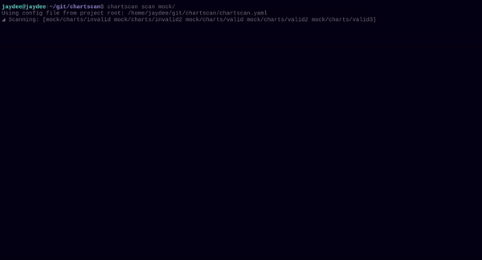

# ChartScan

[](https://github.com/Jaydee94/chartscan/releases)
[](https://github.com/Jaydee94/chartscan/actions/workflows/go-build.yml)
[](https://github.com/Jaydee94/chartscan/actions/workflows/go-test.yml)

[](LICENSE)


**ChartScan** is a command-line tool for validating Helm charts before they ship. It walks a directory, finds every chart, renders the templates with the values you give it, and reports anything that fails to lint, fails to render, or references a value that is not defined.


---

## Features

- Recursively discovers Helm charts under any directory.
- Renders charts with one or more values files and `--set` overrides.
- Detects undefined `.Values` references in templates.
- Four output formats: `pretty`, `json`, `yaml`, `junit`.
- YAML configuration with named environments (`test`, `staging`, `production`, …).
- Automatically loads `chartscan.yaml` from the root of the current Git repository.
- Renders charts to stdout or to a file via `chartscan template`.

---

## Installation

### Precompiled binary

Download the binary for your platform from the [Releases page](https://github.com/Jaydee94/chartscan/releases):

| Platform        | Asset                |
|-----------------|----------------------|
| Linux x86_64    | `chartscan-amd64`    |
| Linux ARM64     | `chartscan-arm64`    |
| Linux x86 (32)  | `chartscan-386`      |

Move it into your `PATH`:

```bash
chmod +x chartscan-amd64
sudo mv chartscan-amd64 /usr/local/bin/chartscan
```

### From source

```bash
go install github.com/Jaydee94/chartscan/cmd/chartscan@latest
```

Requires Go 1.26 or newer (see [go.mod](go.mod)).

---

## Prerequisites

- [Helm](https://helm.sh/docs/intro/install/) on your `PATH`. ChartScan shells out to `helm lint`, `helm template` and `helm dependency update`.

---

## Quickstart

Scan a single chart:

```bash
chartscan scan ./charts/my-chart -f values.yaml
```

Scan every chart under a directory and emit JUnit for CI:

```bash
chartscan scan ./charts -o junit > report.xml
```

Render a chart with `helm template`:

```bash
chartscan template ./charts/my-chart -f values.yaml -o rendered.yaml
```

Use a config file:

```bash
chartscan scan -c chartscan.yaml
```

When you run ChartScan inside a Git repository that has a `chartscan.yaml` at its root, the file is picked up automatically — no `-c` needed.

---

## Demo



---

## Documentation

- [Usage reference](docs/usage.md) — every command, flag, and example.
- [Configuration](docs/configuration.md) — `chartscan.yaml` schema, environments, auto-discovery.
- [Contributing](CONTRIBUTING.md) — local setup, tests, PR workflow.

---

## License

Released under the terms of the [LICENSE](LICENSE) file in this repository.
